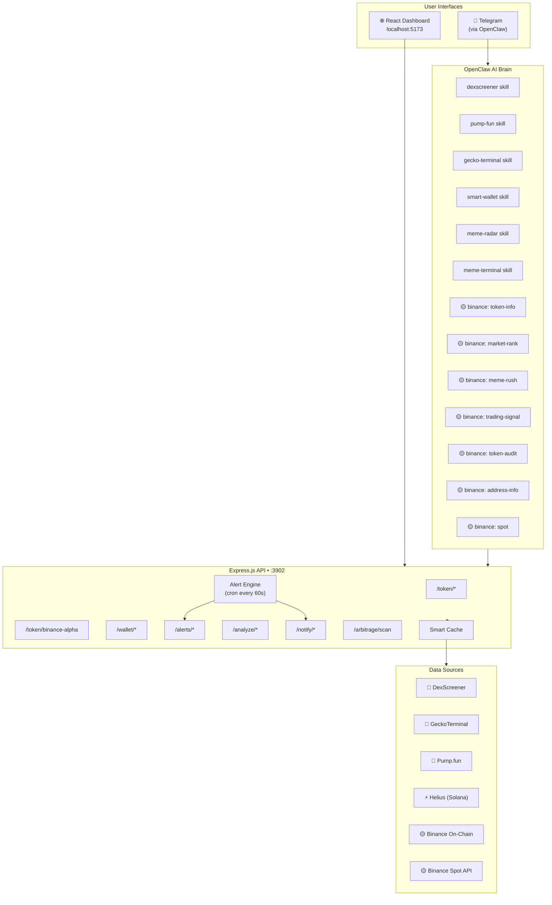
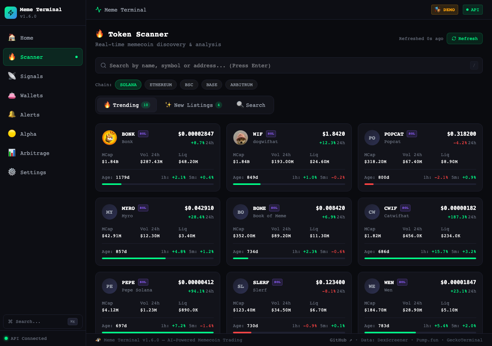
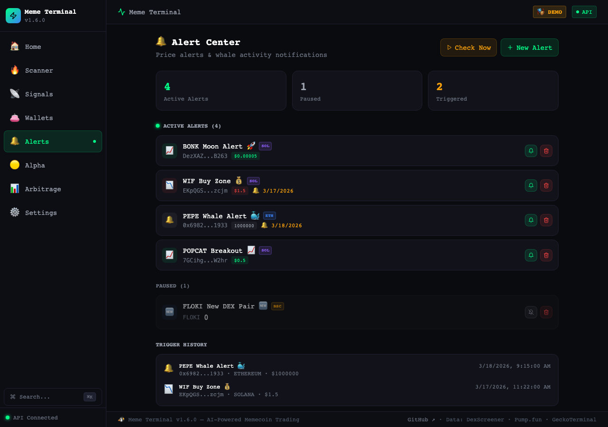
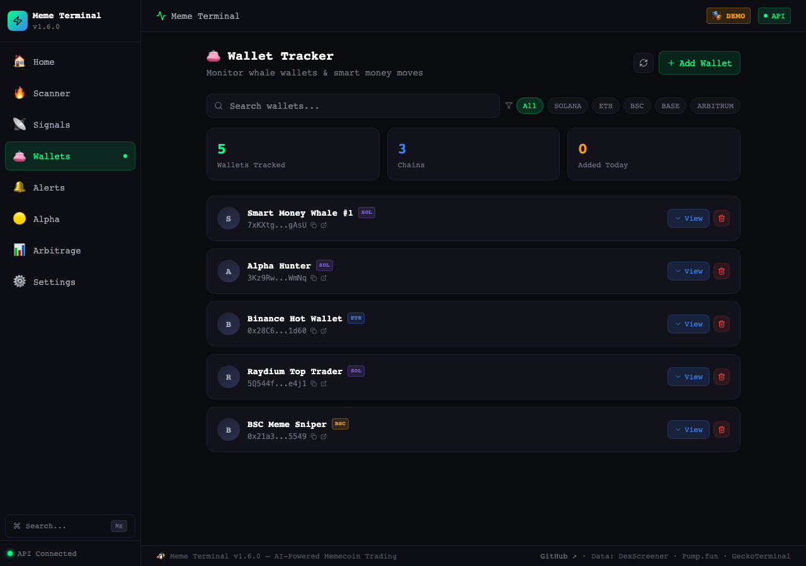
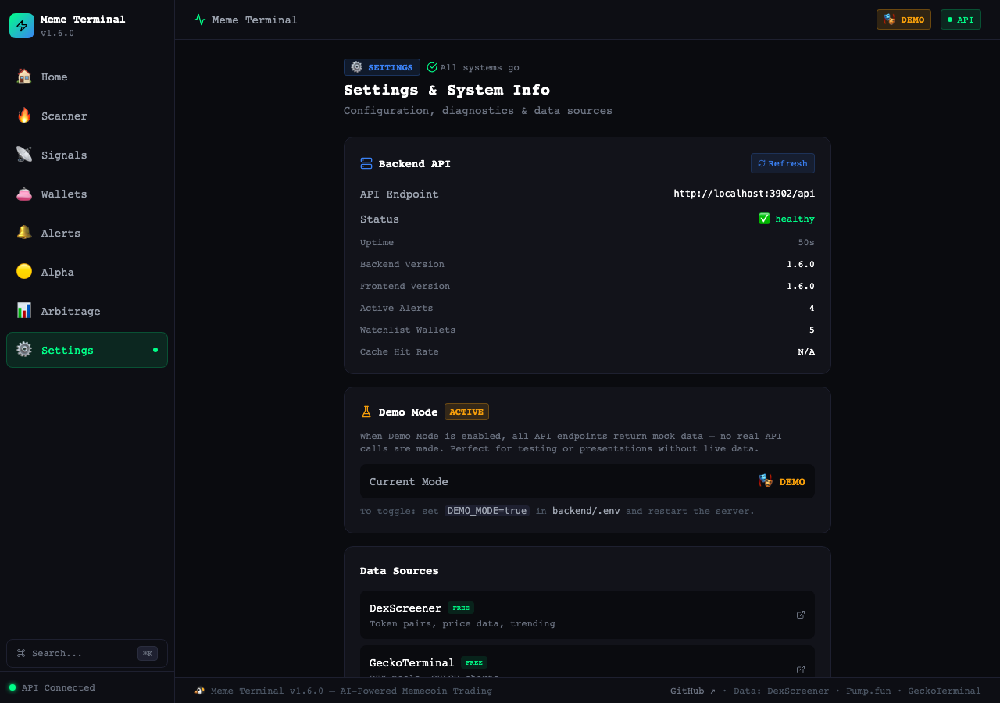

<div align="center">

# 🚀 Meme Terminal

### *One person = One quant team*

[](docs/BINANCE-SKILLS.md)
[](docs/BINANCE-SKILLS.md)
[](docs/BINANCE-SKILLS.md)

[](LICENSE)
[](https://nodejs.org/)
[](https://reactjs.org/)
[](https://openclaw.dev)
[](CONTRIBUTING.md)

**AI-powered memecoin intelligence. Real-time scanning. Natural-language trading queries via Telegram.**

[Quick Start](#-quick-start) · [Binance Skills](#-powered-by-binance-skills-hub) · [Features](#-features) · [Architecture](#-architecture) · [API Docs](docs/API.md) · [Skills Guide](docs/SKILLS-GUIDE.md)

</div>

---

## 🎯 What Is Meme Terminal?

Meme Terminal gives a solo trader the analytical firepower of an entire quant team. It aggregates real-time on-chain data from **DexScreener**, **Pump.fun**, **GeckoTerminal**, **Helius**, and **Binance on-chain signals** — surfaced through a beautiful dark-mode dashboard and a natural-language AI layer accessible directly from Telegram.

No Bloomberg terminal subscription. No team of analysts. Just one terminal, a Telegram message, and instant alpha.

---

## 🟡 Powered by Binance Skills Hub

> **Meme Terminal is built on 7 official Binance Skills** — providing a complete, end-to-end trading intelligence pipeline exclusive to the Binance ecosystem.

| Skill | Purpose | Binance Exclusive |
|-------|---------|:-----------------:|
| 🔍 **Query Token Info** | Token search, price, K-line charts across BSC/Base/Solana | ✅ |
| 🛡️ **Query Token Audit** | Honeypot detection, rug-pull risk, scam classification | ✅ |
| 📊 **Crypto Market Rank** | Trending, Alpha picks, social hype, smart money inflow | ✅ |
| 🚀 **Meme Rush** | Real-time launchpad token tracking (Pump.fun, Four.meme) | ✅ |
| 👛 **Query Address Info** | Wallet portfolio & token positions on-chain | ✅ |
| ⚡ **Trading Signal** | Smart money buy/sell signals with trigger prices & max gain | ✅ |
| 💹 **Binance Spot** | CEX price reference, order book, 24h stats for listed tokens | ✅ |

**Example conversations (Telegram):**
```
You: 查一下 BONK
Terminal: 📊 BONK — $0.0000142 | +12.4% 24h | Vol $48M | Audit: SAFE ✅

You: pump.fun 现在什么最热
Terminal: 🔥 Top 5 launches: 1. PEPE2 (87% bonded)...

You: 这个地址安全吗？ 0xABC...
Terminal: 🛡️ 安全审计: 合约已验证 ✅ | 无蜜罐 ✅ | 流动性锁仓 ✅
```

→ Full skill guide: **[docs/BINANCE-SKILLS.md](docs/BINANCE-SKILLS.md)**

---

## 🟡 Binance Skills Deep Integration

The 5-step pipeline that powers every trading decision in Meme Terminal:

```
┌─────────────────────────────────────────────────────────────────────┐
│                    MEME TERMINAL TRADING PIPELINE                   │
├──────────┬──────────┬──────────┬──────────┬────────────────────────┤
│  Step 1  │  Step 2  │  Step 3  │  Step 4  │       Step 5           │
│ DISCOVER │ RESEARCH │  AUDIT   │  SIGNAL  │       EXECUTE          │
├──────────┼──────────┼──────────┼──────────┼────────────────────────┤
│Meme Rush │  Token   │  Token   │ Trading  │    Binance Spot        │
│(Pump.fun,│  Info    │  Audit   │  Signal  │  (CEX price ref +      │
│Four.meme)│(price,   │(honeypot,│(smart    │   arbitrage scanner)   │
│          │ volume,  │ rug, scam│ money    │                        │
│          │ holders) │ check)   │ signals) │                        │
├──────────┼──────────┼──────────┼──────────┼────────────────────────┤
│🟡 Binance│🟡 Binance│🟡 Binance│🟡 Binance│     🟡 Binance         │
│Meme Rush │Token Info│ Token    │ Trading  │       Spot             │
│  Skill   │  Skill   │  Audit   │  Signal  │       Skill            │
└──────────┴──────────┴──────────┴──────────┴────────────────────────┘
```

**Real example**: Found "MOONCAT" on Meme Rush (82% bonding curve)
1. **Token Info** → $0.0000892, vol $45k/24h, 234 holders — momentum growing ✅
2. **Token Audit** → SAFE, no mint authority, dev holds 0.5%, top10: 18% ✅
3. **Trading Signal** → 3 smart wallets bought in last 2h (bullish signal) ✅
4. **Binance Spot** → Not listed on CEX yet → early DEX entry opportunity ✅
5. → **BUY** on Raydium at $0.0000892, target $0.0005 (+460% 🚀)

---

## ⚡ Why Meme Terminal?

| Feature | **Meme Terminal** | GMGN | DEXScreener | Birdeye |
|---------|:-----------------:|:----:|:-----------:|:-------:|
| **🟡 Binance smart money signals** | ✅ | ❌ | ❌ | ❌ |
| **🟡 Binance token security audit** | ✅ | ❌ | ❌ | ❌ |
| **🟡 Binance Alpha token discovery** | ✅ | ❌ | ❌ | ❌ |
| **🟡 Meme Rush launchpad tracker** | ✅ | ❌ | ❌ | ❌ |
| **🟡 CEX-DEX arbitrage scanner** | ✅ | ❌ | ❌ | ❌ |
| Real-time token scanner | ✅ | ✅ | ✅ | ✅ |
| Pump.fun bonding curve tracking | ✅ | ✅ | ❌ | ❌ |
| Wallet / smart money tracking | ✅ | ✅ | ❌ | ✅ |
| Telegram push alerts | ✅ | ✅ | ❌ | ⚠️ paid |
| **Natural-language Telegram queries** | ✅ | ❌ | ❌ | ❌ |
| **AI-powered token analysis** | ✅ | ❌ | ❌ | ❌ |
| Multi-chain (SOL/ETH/BSC/Base/ARB) | ✅ | ⚠️ SOL only | ✅ | ✅ |
| Self-hosted / open source | ✅ | ❌ | ❌ | ❌ |
| **Cost** | **Free** | Freemium | Free | Freemium |

---

## ✨ Features

### 🔍 Token Intelligence
- 🔥 **Live Token Scanner** — Real-time search, trending pairs, and new listings across all major chains
- 💊 **Pump.fun Monitor** — Track launches by stage: new / finalizing / migrated; bonding curve progress; King of the Hill
- 📈 **Price & Volume Tracking** — 24h change, volume, liquidity, FDV via DexScreener + GeckoTerminal
- 🧪 **AI Token Analysis** — Natural-language analysis combining on-chain data + Binance signals

### 🟡 Binance-Exclusive Features
- 🔍 **Binance Alpha Discovery** — Early-stage curated tokens before mainstream listing
- 📊 **CEX-DEX Arbitrage Scanner** — Spot price gaps between Binance Spot and on-chain DEX
- 🧠 **Smart Money Signals** — Binance smart wallet buy/sell signals with trigger prices
- 🛡️ **Token Security Audit** — Honeypot/rug-pull detection powered by Binance's security engine

### 👛 Wallet Intelligence
- 🐋 **Smart Wallet Tracker** — Watch whale wallets, detect buy/sell moves in real time
- 📊 **Portfolio Snapshot** — Token balances + positions for any wallet across chains
- 🔗 **Trade History** — Recent transactions with profit/loss context

### 🔔 Alert Engine
- ⚡ **Price Alerts** — Trigger above/below custom thresholds
- 🐳 **Large Tx Detection** — Whale buys/sells notification
- 🆕 **New Listing Alerts** — First to know when new pairs appear
- 📲 **Telegram Push** — Instant delivery, never miss a move

### 🤖 AI Skills Layer (OpenClaw)
- 💬 **Natural Language** — Ask in plain text: "查一下 BONK 现在涨了多少"
- 🟡 **7 Binance Skills** — Token info, market rank, meme rush, trading signals, wallet audit, security scan, spot
- 📡 **6 Custom Skills** — DexScreener, Pump.fun, GeckoTerminal, Smart Wallet, Meme Radar, Terminal

### 🛡️ Production-Grade Infrastructure
- ⚡ **Smart TTL Caching** — Adaptive cache with hit/miss analytics, minimizes API quota burn
- 🔄 **Exponential Backoff** — Graceful retry on all external API calls
- 🛡️ **Security Hardened** — Helmet headers, CORS, express-rate-limit, input validation
- 📝 **Structured Logging** — Daily rotating logs, request tracing
- 💾 **Resilient Data Store** — Auto-create, corruption detection, backup/restore for watchlist + alerts

---

## 🏗️ Architecture



---

## 📸 Screenshots

<p align="center">
  
  <br><em>Real-time token scanner with trending detection</em>
</p>

<p align="center">
  
  <br><em>Custom alert engine with multi-condition rules</em>
</p>

<p align="center">
  
  <br><em>Smart wallet tracker — follow whale moves in real time</em>
</p>

<p align="center">
  
  <br><em>Settings & API health dashboard</em>
</p>

> 📷 Add your own screenshots — see [`docs/screenshots/README.md`](docs/screenshots/README.md)

---

## ⚡ Quick Start

```bash
# 1. Clone
git clone https://github.com/Penguin-Life/meme-terminal.git && cd meme-terminal

# 2. Setup backend
cd backend && npm install && cp .env.example .env && npm start &

# 3. Setup frontend
cd ../frontend && npm install && npm run dev
```

Open **http://localhost:5173** — you're live. 🎉

---

## 📦 Full Setup Guide

### Prerequisites

| Requirement | Version | Notes |
|-------------|---------|-------|
| Node.js | ≥ 22.0.0 | Use `nvm install 22` |
| npm | ≥ 10.0.0 | Comes with Node 22 |
| OpenClaw | latest | For AI skills layer |

### Backend

```bash
cd backend

# Install
npm install

# Configure
cp .env.example .env
```

Edit `.env`:

```env
PORT=3902
NODE_ENV=development
ALLOWED_ORIGINS=http://localhost:5173

# For Telegram alerts (optional but recommended)
TELEGRAM_BOT_TOKEN=your_token_from_botfather
TELEGRAM_CHAT_ID=your_chat_id

# For enhanced Solana data (optional)
HELIUS_API_KEY=your_helius_key
```

**Get Telegram credentials:**
1. Message [@BotFather](https://t.me/BotFather) → `/newbot` → copy token
2. Message [@userinfobot](https://t.me/userinfobot) → copy your ID

```bash
# Development (auto-reload)
npm run dev

# Production
npm start
```

Backend runs at **http://localhost:3902**

### Frontend

```bash
cd frontend

# Install
npm install

# Configure (optional)
cp .env.example .env
# VITE_API_URL=http://localhost:3902/api

# Development
npm run dev

# Production build
npm run build
# → Output: frontend/dist/
```

Frontend runs at **http://localhost:5173**

### OpenClaw Skills

Install all 6 custom skills:

```bash
cp -r skills/dexscreener ~/openclaw/skills/
cp -r skills/pump-fun ~/openclaw/skills/
cp -r skills/gecko-terminal ~/openclaw/skills/
cp -r skills/smart-wallet ~/openclaw/skills/
cp -r skills/meme-radar ~/openclaw/skills/
cp -r skills/meme-terminal ~/openclaw/skills/
```

Then reload OpenClaw and try in Telegram:
```
查 BONK
新的 pump.fun 热门项目
帮我追踪钱包 5YNmS...
```

See [docs/SKILLS-GUIDE.md](docs/SKILLS-GUIDE.md) for complete usage guide.

---

## 📡 API Reference

Base URL: `http://localhost:3902/api`

| Category | Endpoint | Description |
|----------|----------|-------------|
| Health | `GET /health` | Service status, uptime, version |
| Cache | `GET /cache/stats` | Cache hit rate, entry count |
| Tokens | `GET /token/search?q=` | Search tokens by name/symbol |
| Tokens | `GET /token/trending` | Top trending pairs |
| Tokens | `GET /token/new` | Latest listed pairs |
| Tokens | `GET /token/:chain/:address` | Token details by address |
| **🟡 Alpha** | `GET /token/binance-alpha` | Binance Alpha curated tokens |
| **🟡 Alpha** | `GET /token/binance-alpha/trending` | Trending Alpha + overall tokens |
| **🟡 Arbitrage** | `GET /arbitrage/scan` | Bulk CEX-DEX price comparison |
| **🟡 Arbitrage** | `GET /arbitrage/scan?symbol=BONKUSDT` | Single symbol scan |
| **🟡 Arbitrage** | `GET /arbitrage/pairs` | Supported symbol list |
| Wallets | `GET /wallet/watchlist` | Get watchlist |
| Wallets | `POST /wallet/watchlist` | Add wallet to watchlist |
| Wallets | `DELETE /wallet/watchlist/:address` | Remove wallet from watchlist |
| Wallets | `GET /wallet/:chain/:address` | Wallet balances + positions |
| Wallets | `GET /wallet/:chain/:address/trades` | Recent trade history |
| Alerts | `GET /alerts` | List all alerts |
| Alerts | `POST /alerts` | Create alert |
| Alerts | `PATCH /alerts/:id` | Update alert |
| Alerts | `DELETE /alerts/:id` | Remove alert |
| Alerts | `GET /alerts/check` | Manually trigger alert check |
| Analysis | `POST /analyze/token` | AI token analysis |
| Analysis | `POST /analyze/wallet` | AI wallet analysis |
| Analysis | `POST /analyze/market` | AI market overview |
| Notify | `POST /notify/telegram` | Send Telegram message |
| Notify | `POST /notify/test` | Test notification setup |

**Rate limits:** 60 req/min (search), 20 req/min (analysis), 10 req/min (notify)

→ Full request/response schema: **[docs/API.md](docs/API.md)**

---

## 🤖 OpenClaw Skills

Meme Terminal ships with **13 skills** total — 6 custom + 7 Binance:

| Skill | Type | Capability |
|-------|------|-----------|
| `meme-terminal` | Custom | Full pipeline: search → analyze → signal |
| `dexscreener` | Custom | Token search, prices, trending pairs |
| `pump-fun` | Custom | New launches, bonding curve, KOTH |
| `gecko-terminal` | Custom | Multi-chain DEX pools and OHLCV |
| `smart-wallet` | Custom | Whale tracking, wallet analysis |
| `meme-radar` | Custom | Unified scanner across all sources |
| `query-token-info` | **🟡 Binance** | Token metadata, price, K-line charts |
| `crypto-market-rank` | **🟡 Binance** | Trending, social hype, smart money, Alpha |
| `meme-rush` | **🟡 Binance** | Launchpad tokens, topic rush |
| `trading-signal` | **🟡 Binance** | Smart money buy/sell signals |
| `query-address-info` | **🟡 Binance** | Wallet token balances on-chain |
| `query-token-audit` | **🟡 Binance** | Scam/honeypot security scan |
| `spot` | **🟡 Binance** | Spot market data, CEX-DEX arbitrage |

---

## 🔧 Tech Stack

| Layer | Technology |
|-------|-----------|
| **Runtime** |  |
| **Backend** |  |
| **Frontend** |   |
| **Styling** |  |
| **Charts** |  |
| **Icons** |  |
| **AI Layer** |  |
| **Routing** |  |
| **HTTP** |  |
| **Data** |  |

---

## 🗺️ Roadmap

### v1.0.0 — Shipped ✅
- Real-time token scanner (multi-chain)
- Pump.fun monitor with bonding curve
- Smart wallet tracker
- Alert engine + Telegram push
- AI skills layer (6 custom + 7 Binance)
- Production-grade backend (caching, retry, security)
- Responsive dark-mode React dashboard

### v1.1.0 — Shipped ✅
- Demo mode with rich mock data for offline usage
- One-click `scripts/setup.sh` installer
- Docker + docker-compose for deployment
- Binance integration showcase (`docs/BINANCE-SKILLS.md`)

### v1.2.0 — Shipped ✅
- 🟡 Binance Alpha Token page — discover Binance-curated alpha tokens early
- 📊 CEX-DEX Arbitrage Scanner — spot price gaps between Binance and DEX
- 🏗️ README restructured with Binance-first positioning
- 📝 New arbitrage and alpha discovery workflows in docs

### v1.3.0 — Shipped ✅
- 🔐 Spot Trading integration (buy/sell/safe-buy via Binance API)
- 🛡️ One-click Safe Buy: Token Audit → Signal Check → Order
- 📡 Smart Money Signal Feed with chain/type filters
- 🏠 Dashboard home page (four-panel overview)
- 🔍 Token Detail page (K-line chart + security audit + signals)
- ⚡ WebSocket real-time price stream (Binance WS → SSE)
- 🧪 Jest unit tests (9 cases)
- 📱 Mobile responsive bottom tab navigation

### v1.5.0 — Shipped ✅
- ⌘K **Command Palette** — VS Code-style quick navigation & token search from anywhere
- 🧩 **Shared component library** — `<PageHeader>`, `<EmptyState>`, `<ErrorBanner>` reusable across all pages
- 🔧 **format.js utility module** — Centralized `fmtUsd`, `fmtPrice`, `fmtCompact`, `timeAgo`, `shortAddr`, `fmtAge` — eliminated 6+ duplicate formatting functions
- 🔍 **SEO overhaul** — Open Graph, Twitter Card, meta descriptions, theme-color
- 🎨 **UX polish across all pages** — loading skeletons, shimmer animations, copy-to-clipboard buttons, live timers, sort controls, search & filter bars
- 🛡️ **Backend hardening** — CSP header fix, wallet chain/address validation, improved error logging
- ♻️ **Architecture cleanup** — Version unified at v1.5.0, removed dead imports, consistent error patterns

### v1.6.0 — Planned 📋
- [ ] Binance Pay integration for direct in-app funding
- [ ] Cross-chain arbitrage alerts (Solana ↔ BSC ↔ Base)
- [ ] Portfolio P&L tracking with historical snapshots
- [ ] Copy-trade signal detection
- [ ] Rug-pull risk scoring with ML model

### v2.0.0 — Vision 🔭
- [ ] DEX aggregator swap integration
- [ ] Backtesting engine for alert strategies
- [ ] Social sentiment analysis (Twitter/X + Telegram)
- [ ] Mobile app (React Native)

---

## 🤝 Contributing

We welcome contributions! Please read [CONTRIBUTING.md](CONTRIBUTING.md) first.

```bash
# Fork → clone → branch
git checkout -b feat/your-amazing-feature

# Make changes, then:
git commit -m "feat: add amazing feature"
git push origin feat/your-amazing-feature
# → Open a Pull Request
```

---

## 🔒 Security

Found a vulnerability? Please **do not** open a public issue. See [SECURITY.md](SECURITY.md) for responsible disclosure guidelines.

---

## 📄 License

MIT — see [LICENSE](LICENSE)

---

## 🙏 Acknowledgments

Built on the shoulders of giants:

- [Binance Skills Hub](https://github.com/binance) — 7 official on-chain skills powering the trading pipeline
- [DexScreener](https://dexscreener.com) — Free DEX pair API
- [GeckoTerminal](https://geckoterminal.com) — Multi-chain pool data
- [Pump.fun](https://pump.fun) — Solana meme launch platform
- [Helius](https://helius.dev) — Solana RPC & indexer
- [OpenClaw](https://openclaw.dev) — AI agent framework

---

<div align="center">

**Built with 🐧 love by [Penguin-Life](https://github.com/Penguin-Life)**

*One person. One terminal. One quant team.*

[](docs/BINANCE-SKILLS.md)

⭐ If this helps your trading, star the repo!

</div>
