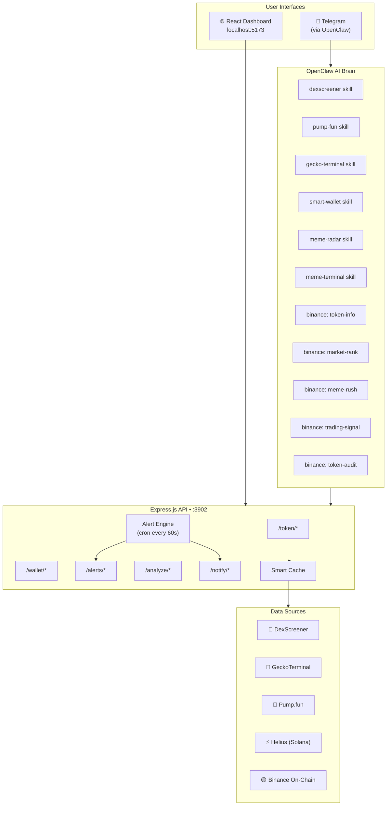

<div align="center">

# 🚀 Meme Terminal

### *One person = One quant team*

[](LICENSE)
[](https://nodejs.org/)
[](https://reactjs.org/)
[](docs/SKILLS-GUIDE.md)
[](https://openclaw.dev)
[](CONTRIBUTING.md)

**AI-powered memecoin intelligence. Real-time scanning. Natural-language trading queries via Telegram.**

[Quick Start](#-quick-start) · [Features](#-features) · [Architecture](#-architecture) · [API Docs](docs/API.md) · [Skills Guide](docs/SKILLS-GUIDE.md)

</div>

---

## 🎯 What Is Meme Terminal?

Meme Terminal gives a solo trader the analytical firepower of an entire quant team. It aggregates real-time on-chain data from **DexScreener**, **Pump.fun**, **GeckoTerminal**, **Helius**, and **Binance on-chain signals** — surfaced through a beautiful dark-mode dashboard and a natural-language AI layer accessible directly from Telegram.

No Bloomberg terminal subscription. No team of analysts. Just one terminal, a Telegram message, and instant alpha.

---

## ⚡ Why Meme Terminal?

| Feature | **Meme Terminal** | GMGN | DEXScreener | Birdeye |
|---------|:-----------------:|:----:|:-----------:|:-------:|
| Real-time token scanner | ✅ | ✅ | ✅ | ✅ |
| Pump.fun bonding curve tracking | ✅ | ✅ | ❌ | ❌ |
| Wallet / smart money tracking | ✅ | ✅ | ❌ | ✅ |
| Telegram push alerts | ✅ | ✅ | ❌ | ⚠️ paid |
| **Natural-language Telegram queries** | ✅ | ❌ | ❌ | ❌ |
| **Binance on-chain smart money signals** | ✅ | ❌ | ❌ | ❌ |
| **AI-powered token analysis** | ✅ | ❌ | ❌ | ❌ |
| Multi-chain (SOL/ETH/BSC/Base/ARB) | ✅ | ⚠️ SOL only | ✅ | ✅ |
| Self-hosted / open source | ✅ | ❌ | ❌ | ❌ |
| **Cost** | **Free** | Freemium | Free | Freemium |

---

## ✨ Features

### 🔍 Token Intelligence
- 🔥 **Live Token Scanner** — Real-time search, trending pairs, and new listings across all major chains
- 💊 **Pump.fun Monitor** — Track launches by stage: new / finalizing / migrated; bonding curve progress; King of the Hill
- 📈 **Price & Volume Tracking** — 24h change, volume, liquidity, FDV via DexScreener + GeckoTerminal
- 🧪 **AI Token Analysis** — Natural-language analysis combining on-chain data + Binance signals

### 👛 Wallet Intelligence
- 🐋 **Smart Wallet Tracker** — Watch whale wallets, detect buy/sell moves in real time
- 📊 **Portfolio Snapshot** — Token balances + positions for any wallet across chains
- 🔗 **Trade History** — Recent transactions with profit/loss context
- 🧠 **Smart Money Signals** — Binance on-chain smart money inflow rankings

### 🔔 Alert Engine
- ⚡ **Price Alerts** — Trigger above/below custom thresholds
- 🐳 **Large Tx Detection** — Whale buys/sells notification
- 🆕 **New Listing Alerts** — First to know when new pairs appear
- 📲 **Telegram Push** — Instant delivery, never miss a move

### 🤖 AI Skills Layer (OpenClaw)
- 💬 **Natural Language** — Ask in plain text: "查一下 BONK 现在涨了多少"
- 🔗 **7 Binance Skills** — Token info, market rank, meme rush, trading signals, wallet audit, security scan
- 📡 **6 Custom Skills** — DexScreener, Pump.fun, GeckoTerminal, Smart Wallet, Meme Radar, Terminal

### 🛡️ Production-Grade Infrastructure
- ⚡ **Smart TTL Caching** — Adaptive cache with hit/miss analytics, minimizes API quota burn
- 🔄 **Exponential Backoff** — Graceful retry on all external API calls
- 🛡️ **Security Hardened** — Helmet headers, CORS, express-rate-limit, input validation
- 📝 **Structured Logging** — Daily rotating logs, request tracing
- 💾 **Resilient Data Store** — Auto-create, corruption detection, backup/restore for watchlist + alerts

---

## 🏗️ Architecture



---

## ⚡ Quick Start

```bash
# 1. Clone
git clone https://github.com/Penguin-Life/meme-terminal.git && cd meme-terminal

# 2. Setup backend
cd backend && npm install && cp .env.example .env && npm start &

# 3. Setup frontend
cd ../frontend && npm install && npm run dev
```

Open **http://localhost:5173** — you're live. 🎉

---

## 📦 Full Setup Guide

### Prerequisites

| Requirement | Version | Notes |
|-------------|---------|-------|
| Node.js | ≥ 22.0.0 | Use `nvm install 22` |
| npm | ≥ 10.0.0 | Comes with Node 22 |
| OpenClaw | latest | For AI skills layer |

### Backend

```bash
cd backend

# Install
npm install

# Configure
cp .env.example .env
```

Edit `.env`:

```env
PORT=3902
NODE_ENV=development
ALLOWED_ORIGINS=http://localhost:5173

# For Telegram alerts (optional but recommended)
TELEGRAM_BOT_TOKEN=your_token_from_botfather
TELEGRAM_CHAT_ID=your_chat_id

# For enhanced Solana data (optional)
HELIUS_API_KEY=your_helius_key
```

**Get Telegram credentials:**
1. Message [@BotFather](https://t.me/BotFather) → `/newbot` → copy token
2. Message [@userinfobot](https://t.me/userinfobot) → copy your ID

```bash
# Development (auto-reload)
npm run dev

# Production
npm start
```

Backend runs at **http://localhost:3902**

### Frontend

```bash
cd frontend

# Install
npm install

# Configure (optional)
cp .env.example .env
# VITE_API_URL=http://localhost:3902/api

# Development
npm run dev

# Production build
npm run build
# → Output: frontend/dist/
```

Frontend runs at **http://localhost:5173**

### OpenClaw Skills

Install all 6 custom skills:

```bash
cp -r skills/dexscreener ~/openclaw/skills/
cp -r skills/pump-fun ~/openclaw/skills/
cp -r skills/gecko-terminal ~/openclaw/skills/
cp -r skills/smart-wallet ~/openclaw/skills/
cp -r skills/meme-radar ~/openclaw/skills/
cp -r skills/meme-terminal ~/openclaw/skills/
```

Then reload OpenClaw and try in Telegram:
```
查 BONK
新的 pump.fun 热门项目
帮我追踪钱包 5YNmS...
```

See [docs/SKILLS-GUIDE.md](docs/SKILLS-GUIDE.md) for complete usage guide.

---

## 📡 API Reference

Base URL: `http://localhost:3902/api`

| Category | Endpoint | Description |
|----------|----------|-------------|
| Health | `GET /health` | Service status, uptime, version |
| Cache | `GET /cache/stats` | Cache hit rate, entry count |
| Tokens | `GET /token/search?q=` | Search tokens by name/symbol |
| Tokens | `GET /token/trending` | Top trending pairs |
| Tokens | `GET /token/new` | Latest listed pairs |
| Tokens | `GET /token/:chain/:address` | Token details by address |
| Wallets | `GET /wallet/watchlist` | Get watchlist |
| Wallets | `POST /wallet/watchlist` | Add wallet to watchlist |
| Wallets | `GET /wallet/:chain/:address` | Wallet balances + positions |
| Wallets | `GET /wallet/:chain/:address/trades` | Recent trade history |
| Alerts | `GET /alerts` | List all alerts |
| Alerts | `POST /alerts` | Create alert |
| Alerts | `PATCH /alerts/:id` | Update alert |
| Alerts | `DELETE /alerts/:id` | Remove alert |
| Alerts | `POST /alerts/check` | Manually trigger alert check |
| Analysis | `POST /analyze/token` | AI token analysis |
| Analysis | `POST /analyze/wallet` | AI wallet analysis |
| Analysis | `POST /analyze/market` | AI market overview |
| Notify | `POST /notify/telegram` | Send Telegram message |
| Notify | `POST /notify/test` | Test notification setup |

**Rate limits:** 60 req/min (search), 20 req/min (analysis), 10 req/min (notify)

→ Full request/response schema: **[docs/API.md](docs/API.md)**

---

## 🤖 OpenClaw Skills

Meme Terminal ships with **13 skills** total — 6 custom + 7 Binance:

| Skill | Type | Capability |
|-------|------|-----------|
| `meme-terminal` | Custom | Full pipeline: search → analyze → signal |
| `dexscreener` | Custom | Token search, prices, trending pairs |
| `pump-fun` | Custom | New launches, bonding curve, KOTH |
| `gecko-terminal` | Custom | Multi-chain DEX pools and OHLCV |
| `smart-wallet` | Custom | Whale tracking, wallet analysis |
| `meme-radar` | Custom | Unified scanner across all sources |
| `query-token-info` | Binance | Token metadata, price, K-line charts |
| `crypto-market-rank` | Binance | Trending, social hype, smart money |
| `meme-rush` | Binance | Launchpad tokens, topic rush |
| `trading-signal` | Binance | Smart money buy/sell signals |
| `query-address-info` | Binance | Wallet token balances on-chain |
| `query-token-audit` | Binance | Scam/honeypot security scan |
| `spot` | Binance | Spot market data |

**Example conversations:**
```
You: 查一下 BONK
Terminal: 📊 BONK — $0.0000142 | +12.4% 24h | Vol $48M...

You: pump.fun 现在什么最热
Terminal: 🔥 Top 5 launches: 1. PEPE2 (87% bonded)...

You: 这个地址安全吗？ 0xABC...
Terminal: 🛡️ 安全审计: 合约已验证 ✅ | 无蜜罐 ✅ | 流动性锁仓 ✅
```

→ Full examples: **[docs/SKILLS-GUIDE.md](docs/SKILLS-GUIDE.md)**

---

## 🔧 Tech Stack

| Layer | Technology |
|-------|-----------|
| **Runtime** |  |
| **Backend** |  |
| **Frontend** |   |
| **Styling** |  |
| **Charts** |  |
| **Icons** |  |
| **AI Layer** |  |
| **Routing** |  |
| **HTTP** |  |

---

## 🗺️ Roadmap

### v1.0.0 — Current ✅
- Real-time token scanner (multi-chain)
- Pump.fun monitor with bonding curve
- Smart wallet tracker
- Alert engine + Telegram push
- AI skills layer (6 custom + 7 Binance)
- Production-grade backend (caching, retry, security)
- Responsive dark-mode React dashboard

### v1.1.0 — In Progress 🔨
- [ ] Demo mode with rich mock data for offline usage
- [ ] One-click `scripts/setup.sh` installer
- [ ] Docker + docker-compose for deployment
- [ ] Binance integration showcase page

### v1.2.0 — Planned 📋
- [ ] Portfolio P&L tracking with historical snapshots
- [ ] Rug-pull risk scoring (contract analysis)
- [ ] WebSocket streaming for live price ticks
- [ ] Copy-trade signal detection

### v2.0.0 — Vision 🔭
- [ ] DEX aggregator swap integration
- [ ] Backtesting engine for alert strategies
- [ ] Social sentiment analysis (Twitter/X + Telegram)
- [ ] Mobile app (React Native)

---

## 🤝 Contributing

We welcome contributions! Please read [CONTRIBUTING.md](CONTRIBUTING.md) first.

```bash
# Fork → clone → branch
git checkout -b feat/your-amazing-feature

# Make changes, then:
git commit -m "feat: add amazing feature"
git push origin feat/your-amazing-feature
# → Open a Pull Request
```

---

## 🔒 Security

Found a vulnerability? Please **do not** open a public issue. See [SECURITY.md](SECURITY.md) for responsible disclosure guidelines.

---

## 📄 License

MIT — see [LICENSE](LICENSE)

---

## 🙏 Acknowledgments

Built on the shoulders of giants:

- [DexScreener](https://dexscreener.com) — Free DEX pair API
- [GeckoTerminal](https://geckoterminal.com) — Multi-chain pool data
- [Pump.fun](https://pump.fun) — Solana meme launch platform
- [Helius](https://helius.dev) — Solana RPC & indexer
- [Binance Web3](https://github.com/binance) — On-chain skill signals
- [OpenClaw](https://openclaw.dev) — AI agent framework

---

<div align="center">

**Built with 🐧 love by [Penguin-Life](https://github.com/Penguin-Life)**

*One person. One terminal. One quant team.*

⭐ If this helps your trading, star the repo!

</div>
