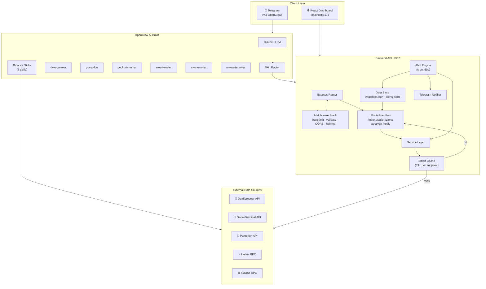
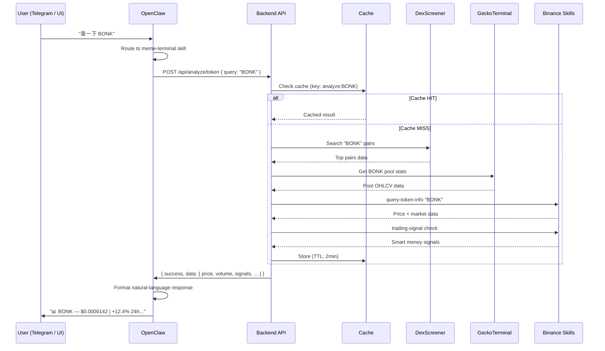
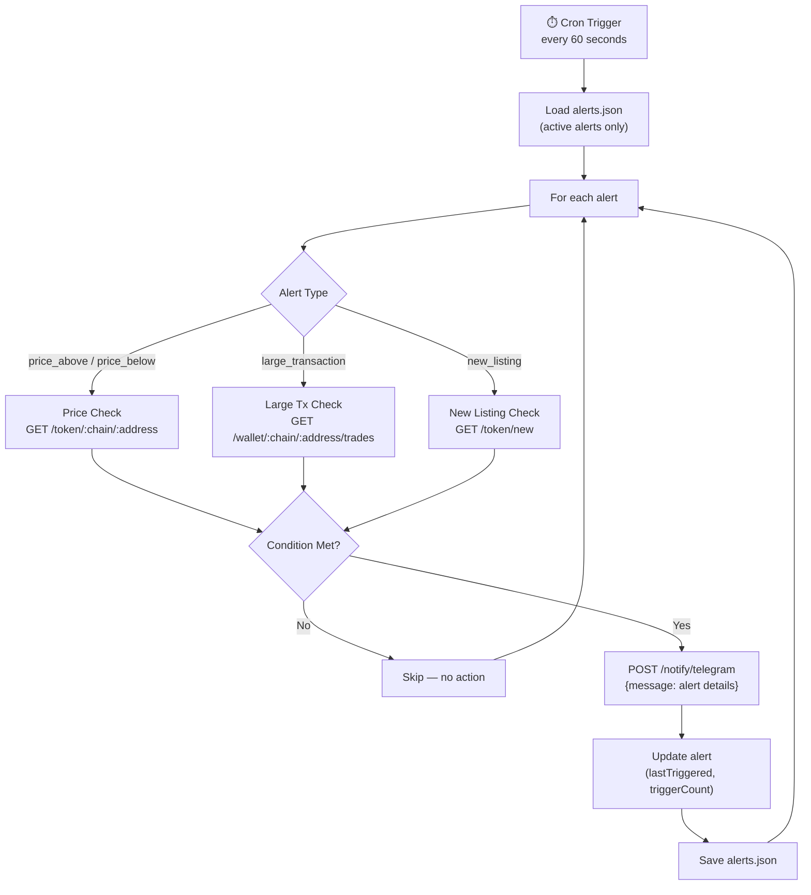
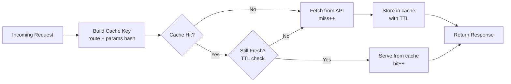
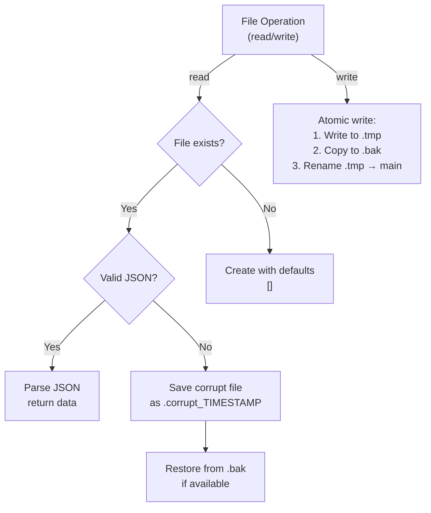
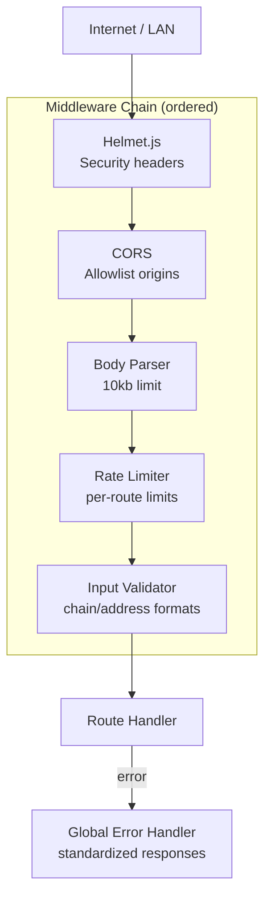
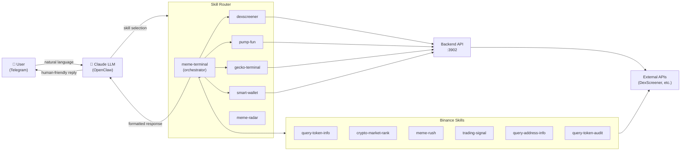

# Meme Terminal — Architecture

This document describes the system architecture, data flows, and key design decisions in Meme Terminal.

---

## Table of Contents

- [System Overview](#system-overview)
- [Component Breakdown](#component-breakdown)
- [Token Analysis Flow](#token-analysis-flow)
- [Alert Engine Flow](#alert-engine-flow)
- [Caching Strategy](#caching-strategy)
- [Data Persistence](#data-persistence)
- [Security Architecture](#security-architecture)
- [AI Skills Layer](#ai-skills-layer)

---

## System Overview

---

## Component Breakdown

### Frontend (React + Vite)

| Component | Responsibility |
|-----------|---------------|
| `App.jsx` | Route configuration (React Router v6), global layout |
| `pages/Scanner.jsx` | Token search, trending, new pairs |
| `pages/Wallets.jsx` | Watchlist management, wallet analysis |
| `pages/Alerts.jsx` | Alert CRUD, status display |
| `pages/SettingsPage.jsx` | Telegram config, API preferences |
| `components/TokenCard.jsx` | Reusable token display with price, volume, chain |
| `components/WalletCard.jsx` | Wallet entry with balance summary |
| `components/SearchBar.jsx` | Debounced search with chain selector |
| `components/LoadingSkeleton.jsx` | Placeholder UI during API loads |
| `utils/api.js` | Axios client, base URL config, error handling |

### Backend (Express.js)

| Module | Responsibility |
|--------|---------------|
| `server.js` | App bootstrap, middleware chain, route mounting |
| `routes/token.js` | Token search, trending, new, detail |
| `routes/wallet.js` | Watchlist CRUD, wallet data, trade history |
| `routes/alert.js` | Alert CRUD, manual trigger |
| `routes/analyze.js` | AI analysis endpoints |
| `routes/notify.js` | Telegram notification dispatch |
| `services/dexscreener.js` | DexScreener API integration |
| `services/gecko.js` | GeckoTerminal API integration |
| `services/pumpfun.js` | Pump.fun API integration |
| `services/solana.js` | Helius / Solana RPC integration |
| `services/alertEngine.js` | Cron-based alert evaluation loop |
| `services/analyzer.js` | AI analysis pipeline |
| `services/notifier.js` | Telegram Bot API dispatcher |
| `services/cache.js` | In-memory TTL cache with stats |
| `utils/dataStore.js` | JSON file persistence with corruption recovery |
| `utils/logger.js` | Winston-based structured logging |
| `utils/retry.js` | Exponential backoff retry wrapper |
| `middleware/rateLimiter.js` | Per-route rate limiting config |
| `middleware/validate.js` | Request validation (chain, address formats) |
| `middleware/errorHandler.js` | Global error handler, standardized responses |

---

## Token Analysis Flow

---

## Alert Engine Flow

---

## Caching Strategy

The cache layer (`services/cache.js`) uses an in-memory TTL map to reduce external API calls.

**TTL by endpoint:**

| Endpoint | TTL | Reasoning |
|----------|-----|-----------|
| `/token/search` | 30s | Search results change frequently |
| `/token/trending` | 2min | Trending is semi-stable |
| `/token/new` | 60s | New listings appear every few minutes |
| `/token/:chain/:address` | 30s | Price-sensitive |
| `/wallet/:chain/:address` | 60s | Balances change on each tx |
| `/analyze/token` | 2min | Heavy computation, acceptable staleness |
| `/analyze/market` | 5min | Market overview is stable enough |

---

## Data Persistence

Watchlist and alert configurations are persisted to JSON files with a resilient store:

**Files:**
- `backend/data/watchlist.json` — tracked wallets
- `backend/data/alerts.json` — alert rules + state
- `backend/data/*.bak` — auto backup before each write
- `backend/data/*.corrupt_TIMESTAMP` — preserved corrupt files for debugging

---

## Security Architecture

**Security headers (via Helmet):**
- `Strict-Transport-Security`
- `X-Content-Type-Options: nosniff`
- `X-Frame-Options: DENY`
- `Content-Security-Policy`
- `X-XSS-Protection`

---

## AI Skills Layer

The OpenClaw skills layer provides natural-language access to all backend capabilities:

The `meme-terminal` skill acts as an **orchestrator** — it decides which sub-skills to invoke based on the query, aggregates results, and formats a comprehensive response.

---

## Key Design Decisions

| Decision | Choice | Rationale |
|----------|--------|-----------|
| **State management** | File-based JSON | No DB dependency; self-contained; easy backup |
| **Caching** | In-memory TTL map | Zero deps; fast; sufficient for single-node |
| **Authentication** | None (localhost) | Self-hosted tool; not a multi-tenant SaaS |
| **Frontend state** | Local component state | No Redux complexity; simpler maintenance |
| **Chart library** | Recharts | Good React integration; lightweight |
| **Retry strategy** | Exponential backoff | Respects API rate limits; avoids thundering herd |
| **Logging** | File + console | Daily rotating logs; debug-friendly |
